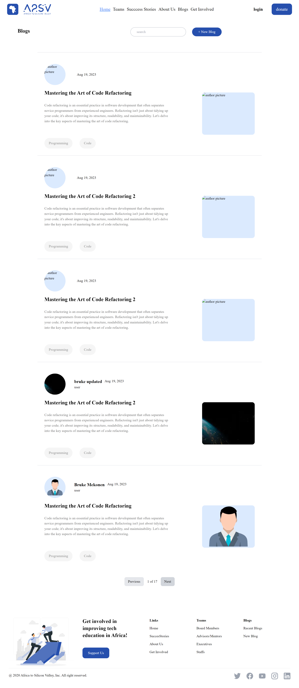
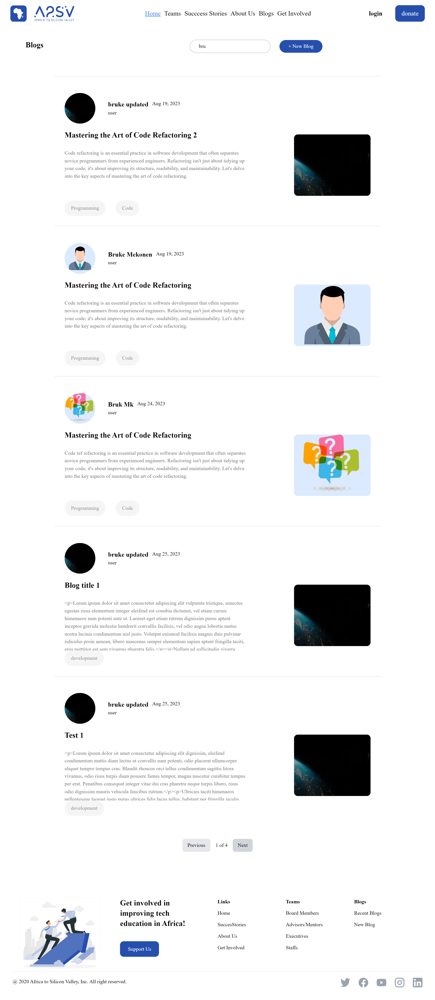
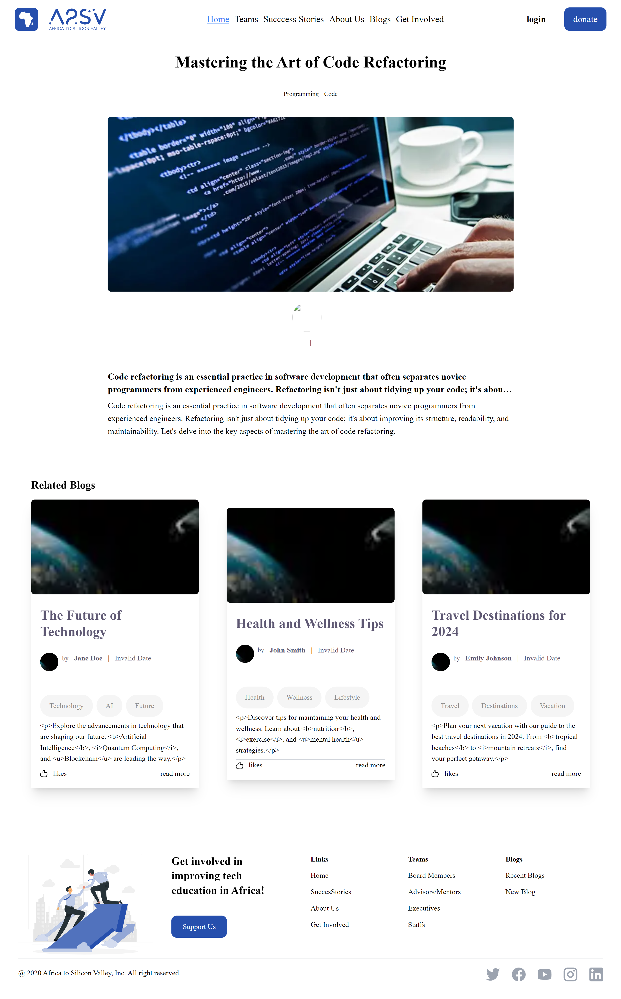

# Blog App


Welcome to the Blog App! This project is a modern, feature-rich blogging platform built with Next.js, Tailwind CSS, TypeScript, Redux, and RTK Query. The application provides a seamless experience for users to explore, search, and manage blog content.

## Features

- **Search Functionality**: Easily search and filter blog posts.
- **Pagination**: Navigate through pages of blog posts with ease.


- **Dynamic Blog Details**: View detailed information about each blog post.
- **Responsive Design**: Fully responsive layout to ensure a smooth experience on any device.

## Live Demo

[Check out the live demo here!](https://example.com)

## Getting Started

To get started with the Blog App, follow these steps:

### Prerequisites

- Node.js (v14 or higher)
- npm or yarn

### Installation

1. **Clone the repository:**

    ```bash
    git clone https://github.com/natinecho/G5_web_assessment.git
    cd G5_web_assessment/blog_app
    ```

2. **Install dependencies:**

    ```bash
    npm install
    # or
    yarn install
    ```

3. **Run the development server:**

    ```bash
    npm run dev
    # or
    yarn dev
    ```

    Visit `http://localhost:3000` in your browser to view the application.

## Features and Functionality

### Blog List

- View a list of blog posts.
- Search for specific blog posts.
- Navigate through pages of blog posts.

### Blog Details

- View detailed information about each blog post.
- Read the full blog content with proper formatting.

## API Integration

The Blog App fetches data from the following API endpoint:

- `https://a2sv-backend.onrender.com/api/blogs`

### API Endpoints

- **Get All Blogs**: `GET /api/blogs`
- **Get Blog by ID**: `GET /api/blogs/:id`
